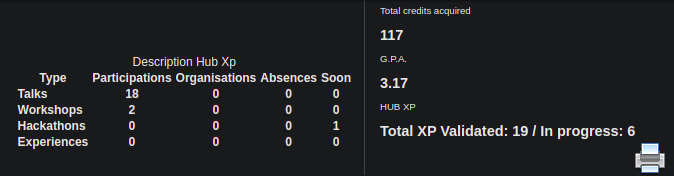

 

# CountHubXp

Add a counter for your hub's experiences on the [intra](https://intra.epitech.eu/user/*)

This extension was forked from this [repository](https://github.com/NialaH/intraxphub_chromemade) created by [Maxime Gravin](https://github.com/NialaH).



It actually support:

- Hackathon
- Workshop / CodingBattle
- Talk / Hubtalk
- Hub Experiences

## Requirement:

- Google Chrome / Firefox

## How to install

<br>

### Step 1 : Clone the repository

```git clone https://github.com/Studio-17/CountHubXp.git```

<br>

### Step 2 : Load the unpacked extension

#### Google Chrome

- Paste ```chrome://extensions/``` in your url.

- Activate Developer Mode

- Load the folder CountHubXp with "Load unpacked".

#### Firefox

- Paste "about:debugging#/runtime/this-firefox" in your url.

- Load Temporary Add-on

- Load the folder CountHubXp.

<br>

---

<div align="center">

<a href="https://github.com/Studio-17" target="_blank"></a>

</div>